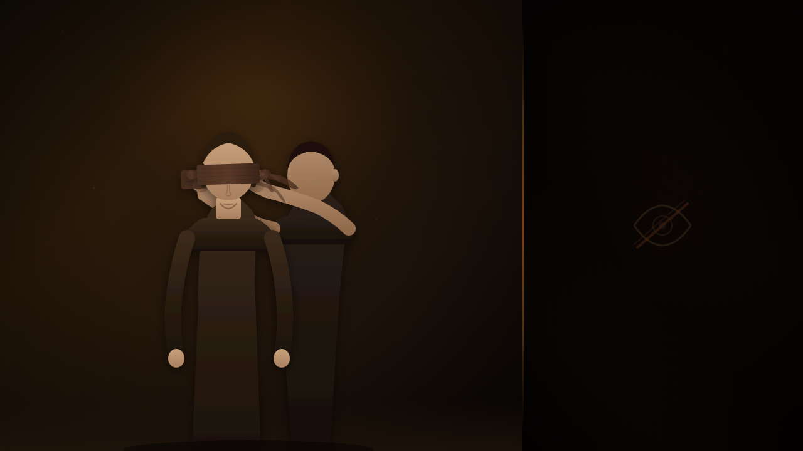

# 🐺 LXR Blindfold System
> **wolves.land** — The Land of Wolves | RedM Blindfold & Restraint Script

```
██╗     ██╗  ██╗██████╗        ██████╗ ██████╗ ██████╗ ███████╗
██║     ╚██╗██╔╝██╔══██╗      ██╔════╝██╔═══██╗██╔══██╗██╔════╝
██║      ╚███╔╝ ██████╔╝█████╗██║     ██║   ██║██████╔╝█████╗
██║      ██╔██╗ ██╔══██╗╚════╝██║     ██║   ██║██╔══██╗██╔══╝
███████╗██╔╝ ██╗██║  ██║      ╚██████╗╚██████╔╝██║  ██║███████╗
╚══════╝╚═╝  ╚═╝╚═╝  ╚═╝       ╚═════╝ ╚═════╝ ╚═╝  ╚═╝╚══════╝
```

[](https://www.wolves.land)
[](https://theluxempire.tebex.io)
[](https://discord.gg/CrKcWdfd3A)



---

## ═══════════════════════════════════════════════════════
## SERVER INFORMATION
## ═══════════════════════════════════════════════════════

| Field       | Value                                      |
|-------------|--------------------------------------------|
| Server      | The Land of Wolves 🐺                      |
| Developer   | iBoss21 / The Lux Empire                   |
| Website     | https://www.wolves.land                    |
| Discord     | https://discord.gg/CrKcWdfd3A             |
| Store       | https://theluxempire.tebex.io              |
| GitHub      | https://github.com/iBoss21                 |

---

## Features

- 🎭 Blindfold the nearest player with a command or item
- 🔒 Blindfold yourself for immersive RP scenarios
- 🎲 Configurable random chance to break free from a blindfold
- 🛒 Optional item (`blindfold`) required to use the script
- 🌐 Multi-framework support — LXR-Core, RSG-Core, VORP Core, QBR-Core
- ⚙️ Fully configurable language, button bindings, and escape odds

---

## Framework Support

| Framework   | Status              |
|-------------|---------------------|
| LXR-Core    | ✅ Primary           |
| RSG-Core    | ✅ Primary           |
| VORP Core   | ✅ Supported/Legacy  |
| QBR-Core    | ✅ Optional          |
| Standalone  | ✅ Fallback          |

---

## Commands

| Command         | Description                                      |
|-----------------|--------------------------------------------------|
| `/blindfold`    | Apply blindfold to the nearest player            |
| `/unblindfold`  | Remove blindfold from the nearest player         |
| `/blindfoldme`  | Apply blindfold to yourself                      |
| `/unblindfoldme`| Remove your own self-applied blindfold           |

---

## Installation

### Step 1 — Download & Install

1. Download or clone this repository.
2. Copy the `lxr-blindfold` folder into your server's `resources/` directory.
3. Add the following line to your `server.cfg`:
   ```
   ensure lxr-blindfold
   ```

### Step 2 — Configure Framework

Open `config.lua` and set your framework:

```lua
Config.Framework = 'lxr-core' -- 'lxr-core' | 'rsg-core' | 'vorp_core' | 'qbr-core' | 'standalone'
```

### Step 3 — Optional: Item Support

If `Config.blindfolditem = true`, players must have a `blindfold` item in their inventory.

1. Import the SQL from `items/blindfold.sql` into your database.
2. Add the item image from `items/blindfold.png` to your inventory system.

---

## Configuration Reference

```lua
-- config.lua

Config.Framework = 'lxr-core'      -- Active framework

Config.blindfoldcommand     = true  -- Enable /blindfold + /unblindfold
Config.blindfoldselfcommand = true  -- Enable /blindfoldme + /unblindfoldme
Config.blindfolditem        = true  -- Require a 'blindfold' item

Config.escape = {
    active   = true,
    lotonumb = {5, 6, 20},     -- Winning numbers (0–5000) that free the player
    button   = 0x760A9C6F,     -- G key to attempt escape
    lang = {
        escape = 'Attempt to Break Blindfold',
        button = 'G'
    }
}

Config.lang = {
    noplayers = "No players nearby",
    noitem    = "You are out of blindfolds",
}
```

---

## Need Support?

- 💬 [Discord](https://discord.gg/CrKcWdfd3A)
- 🌐 [Website](https://www.wolves.land)
- 🛒 [Store](https://theluxempire.tebex.io)

---

> © 2026 iBoss21 / The Lux Empire | wolves.land | All Rights Reserved
